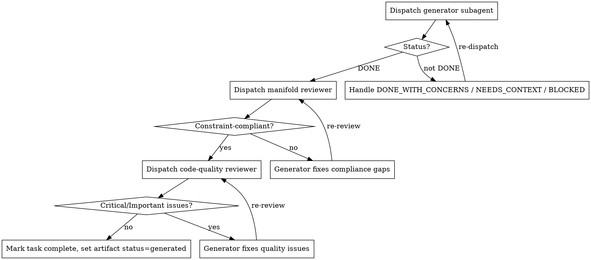

# Subagent-Driven Generation + In-Loop Review — Implementation Plan

> **For agentic workers:** REQUIRED SUB-SKILL: Use superpowers:subagent-driven-development (recommended) or superpowers:executing-plans to implement this plan task-by-task. Steps use checkbox (`- [ ]`) syntax for tracking.

**Goal:** Turn Manifold's `m4-generate` into a subagent coordinator with in-loop review, and apply verification-discipline prompt-craft across all workflow commands.

**Architecture:** Manifold commands are Markdown skill files in `install/commands/`. This plan adds two new reference files, rewrites `m4-generate.md` as a coordinator that dispatches generator/reviewer subagents, hardens `m5-verify.md`, and adds a discipline link + Red Flags section to every workflow command. One TypeScript change fixes `scripts/sync-plugin.ts` so the `commands/references/` subtree reaches `plugin/`.

**Tech Stack:** Markdown skill files, Bun + TypeScript (`scripts/sync-plugin.ts`), Bun test.

**Design spec:** `docs/specs/2026-05-17-subagent-driven-generation-design.md`

---

## File Structure

| File | Status | Responsibility |
|---|---|---|
| `scripts/sync-plugin.ts` | Modify | Recurse the `commands/references/` subtree when syncing to `plugin/` |
| `tests/sync-plugin.test.ts` | Create | Verify the references subtree is synced |
| `install/commands/references/execution-discipline.md` | Create | Shared discipline reference (Iron Law, Red Flags, status protocol, never-on-main) |
| `install/commands/references/subagent-prompts/generator.md` | Create | Generator subagent prompt template |
| `install/commands/references/subagent-prompts/manifold-reviewer.md` | Create | Manifold (constraint-compliance) reviewer prompt template |
| `install/commands/references/subagent-prompts/code-quality-reviewer.md` | Create | Code-quality reviewer prompt template |
| `install/commands/references/subagent-prompts/final-reviewer.md` | Create | Final whole-implementation reviewer prompt template |
| `install/commands/m4-generate.md` | Modify | Becomes the coordinator |
| `install/commands/m5-verify.md` | Modify | SATISFIED evidence floor + discipline link + Red Flags |
| `install/commands/m0-init.md` … `m-solve.md` (7 files) | Modify | Discipline link + Red Flags section |
| `plugin/**`, `install/agents/**` | Regenerate | Built artifacts (Task 7) |

**Pre-existing bug this plan also fixes:** `scripts/sync-plugin.ts` never copies `install/commands/references/` to `plugin/`, so `plugin/commands/m3-anchor.md`'s link to `references/recursive-decomposition.md` is currently broken in the distributed plugin. Task 1 fixes that.

---

## Task 1: Fix `sync-plugin.ts` to sync the `commands/references/` subtree

**Files:**
- Modify: `scripts/sync-plugin.ts`
- Test: `tests/sync-plugin.test.ts`

- [ ] **Step 1: Write the failing test**

Create `tests/sync-plugin.test.ts`:

```typescript
import { test, expect } from "bun:test";
import { existsSync } from "fs";
import { join } from "path";

test("sync-plugin copies the commands/references subtree to plugin/", () => {
  const proc = Bun.spawnSync(["bun", "scripts/sync-plugin.ts"], {
    cwd: process.cwd(),
  });
  expect(proc.exitCode).toBe(0);
  expect(
    existsSync(join("plugin", "commands", "references", "recursive-decomposition.md")),
  ).toBe(true);
});
```

- [ ] **Step 2: Run the test to verify it fails**

Run: `bun test tests/sync-plugin.test.ts`
Expected: FAIL — `plugin/commands/references/recursive-decomposition.md` does not exist (the references subtree is not synced today).

- [ ] **Step 3: Add a recursive `copyTree` helper**

Read `scripts/sync-plugin.ts` first to confirm `readdirSync`, `join`, `syncFile`, and `ensureDir` are already defined/imported (they are — `syncFile` and `ensureDir` are local helpers; `readdirSync` and `join` are imported). Then add this function immediately after the `syncFile` helper definition:

```typescript
// Recursively copy every .md file under srcDir into destDir, preserving structure.
function copyTree(srcDir: string, destDir: string): number {
  let count = 0;
  ensureDir(destDir);
  for (const entry of readdirSync(srcDir, { withFileTypes: true })) {
    const srcPath = join(srcDir, entry.name);
    const destPath = join(destDir, entry.name);
    if (entry.isDirectory()) {
      count += copyTree(srcPath, destPath);
    } else if (entry.name.endsWith(".md")) {
      syncFile(srcPath, destPath);
      count++;
    }
  }
  return count;
}
```

- [ ] **Step 4: Replace the commands sync loop to recurse into subdirectories**

Replace this exact block:

```typescript
for (const file of readdirSync(commandsSrc)) {
  if (file.endsWith(".md")) {
    syncFile(join(commandsSrc, file), join(commandsDest, file));
  }
}
```

with:

```typescript
for (const entry of readdirSync(commandsSrc, { withFileTypes: true })) {
  const srcPath = join(commandsSrc, entry.name);
  if (entry.isDirectory()) {
    copyTree(srcPath, join(commandsDest, entry.name));
  } else if (entry.name.endsWith(".md")) {
    syncFile(srcPath, join(commandsDest, entry.name));
  }
}
```

- [ ] **Step 5: Run the test to verify it passes**

Run: `bun test tests/sync-plugin.test.ts`
Expected: PASS — exit code 0 and the references file now exists in `plugin/`.

- [ ] **Step 6: Commit**

```bash
git add scripts/sync-plugin.ts tests/sync-plugin.test.ts plugin/commands/references/
git commit -m "fix(sync): recurse into commands/references when syncing to plugin"
```

---

## Task 2: Create the shared `execution-discipline.md` reference

**Files:**
- Create: `install/commands/references/execution-discipline.md`

- [ ] **Step 1: Create the reference file**

Create `install/commands/references/execution-discipline.md` with this exact content:

````markdown
# Execution Discipline (shared reference)

Referenced by every Manifold workflow command. These patterns are adapted into
constraint-native form from the `superpowers` plugin; Manifold ships them
self-contained, with no runtime dependency on that plugin.

## The Iron Law of Verification

**NO COMPLETION CLAIM WITHOUT FRESH VERIFICATION EVIDENCE.**

If you have not run the verification command in this message, you cannot claim
it passes. "Should pass", "looks correct", and "I'm confident" are not
evidence.

## The Gate Function

Before claiming any phase, artifact, or task is complete:

1. **IDENTIFY** the command that proves the claim.
2. **RUN** it fresh and in full.
3. **READ** the full output and the exit code.
4. **VERIFY** the output actually confirms the claim.
5. **ONLY THEN** state the claim, with the evidence.

Skipping any step is claiming, not verifying.

## Red Flags — STOP

| Thought | Reality |
|---|---|
| "This is simple, skip the check" | Simple work fails too. Run the check. |
| "Should work now" | Run the verification command. |
| "The subagent reported success" | Verify independently — read the diff. |
| "Just this once" | No exceptions. |
| "Tests passed earlier" | Earlier is not now. Re-run. |
| "Different wording, so the rule doesn't apply" | Spirit over letter. |

## Never Start On Main

Never generate or modify feature artifacts on `main` / `master`. Confirm the
working branch first. If on `main`, create a feature branch and STOP until the
user agrees.

## Generator Status Protocol

A subagent dispatched by a coordinator reports exactly one status line:

| Status | Coordinator response |
|---|---|
| `DONE` | Proceed to review. |
| `DONE_WITH_CONCERNS` | Read the concerns. Address correctness/scope concerns before review; note observations and proceed. |
| `NEEDS_CONTEXT` | Supply the missing context, then re-dispatch. |
| `BLOCKED` | Diagnose: supply more context, re-dispatch with a more capable model, split the task, or escalate to the user. Never re-dispatch the same model unchanged. |
````

- [ ] **Step 2: Verify the file exists and is non-empty**

Run: `test -s install/commands/references/execution-discipline.md && echo OK`
Expected: `OK`

- [ ] **Step 3: Commit**

```bash
git add install/commands/references/execution-discipline.md
git commit -m "docs(commands): add shared execution-discipline reference"
```

---

## Task 3: Create the four subagent prompt templates

**Files:**
- Create: `install/commands/references/subagent-prompts/generator.md`
- Create: `install/commands/references/subagent-prompts/manifold-reviewer.md`
- Create: `install/commands/references/subagent-prompts/code-quality-reviewer.md`
- Create: `install/commands/references/subagent-prompts/final-reviewer.md`

- [ ] **Step 1: Create `generator.md`**

Create `install/commands/references/subagent-prompts/generator.md`:

```markdown
# Generator Subagent — Task Prompt

You are a generator subagent for Manifold's `m4-generate` phase. You implement
ONE task in isolation. You have no prior conversation context — everything you
need is below.

## Your Task

{TASK_DESCRIPTION}

## Constraints You Must Satisfy

{CONSTRAINT_TEXT}

## Target Artifacts

{ARTIFACT_PATHS}

## Rules

- Follow TDD: write the test first, watch it fail, then implement.
- Tests verify CONSTRAINTS, not implementation details. A test named for a
  constraint ("rejects duplicate payments — B1") is correct; a test named for
  a mechanism ("uses Redis") is wrong.
- Add a traceability comment to every artifact: `// Satisfies: <constraint-ids>`.
- Annotate every test function: `// @constraint <id>`.
- Place files exactly per the Artifact Placement Rules in the task above.
- Do NOT do work outside this task's scope. Do NOT touch unrelated files.
- Commit your work once the task's tests pass.

## Report Back

End your response with exactly one status line:

- `STATUS: DONE` — complete, tests pass, committed.
- `STATUS: DONE_WITH_CONCERNS` — complete, but list your doubts below the line.
- `STATUS: NEEDS_CONTEXT` — you are missing information; state precisely what.
- `STATUS: BLOCKED` — you cannot proceed; state the blocker.

Before claiming `DONE` you MUST have run the test command in this session and
seen it pass. No completion claim without fresh verification evidence.
```

- [ ] **Step 2: Create `manifold-reviewer.md`**

Create `install/commands/references/subagent-prompts/manifold-reviewer.md`:

```markdown
# Manifold Reviewer Subagent — Task Prompt

You are a manifold reviewer for Manifold's `m4-generate` phase. You check ONE
task's artifacts against the constraint manifold. You do NOT review code
quality — only constraint compliance.

## Constraints The Artifacts Must Satisfy

{CONSTRAINT_TEXT}

## Artifacts To Review

Diff range: `{BASE_SHA}..{HEAD_SHA}`

## What To Check

1. **Coverage** — is every assigned constraint actually satisfied by the
   artifacts?
2. **Traceability** — does every artifact carry a `// Satisfies:` comment with
   the correct constraint IDs? Do test functions carry `// @constraint`?
3. **Scope** — did the generator build ONLY what the constraints require? Flag
   any feature, flag, or file no assigned constraint asks for (scope creep).
4. **Test derivation** — do the tests verify the constraint, not the mechanism?

## Report Back

End with exactly one status line:

- `REVIEW: COMPLIANT` — every constraint satisfied and traced, no scope creep.
- `REVIEW: NON_COMPLIANT` — list each issue above the line, prefixed
  `MISSING:`, `SCOPE_CREEP:`, or `TRACEABILITY:`, naming the file and
  constraint ID.
```

- [ ] **Step 3: Create `code-quality-reviewer.md`**

Create `install/commands/references/subagent-prompts/code-quality-reviewer.md`:

```markdown
# Code-Quality Reviewer Subagent — Task Prompt

You review ONE task's artifacts for correctness and craft. Constraint
compliance was already confirmed by the manifold reviewer — do NOT re-check it.
Focus only on whether the code is well-built.

## Context

{TASK_DESCRIPTION}

## Artifacts To Review

Diff range: `{BASE_SHA}..{HEAD_SHA}`

## What To Check

- Bugs and incorrect logic.
- Unhandled edge cases and error paths.
- Design — clear boundaries, no needless complexity, idiomatic Bun/TypeScript.
- Tests — do they actually exercise the behavior, or are they hollow?

## Report Back

List issues by severity above the line:

- `Critical:` — a bug; it will break. MUST be fixed.
- `Important:` — should be fixed before proceeding.
- `Minor:` — note for later.

Then end with exactly one status line:

- `REVIEW: APPROVED` — no Critical or Important issues.
- `REVIEW: CHANGES_REQUESTED` — Critical or Important issues listed above.
```

- [ ] **Step 4: Create `final-reviewer.md`**

Create `install/commands/references/subagent-prompts/final-reviewer.md`:

```markdown
# Final Reviewer Subagent — Task Prompt

You review the COMPLETE `m4-generate` implementation across all tasks, end to
end. Per-task reviews already happened — your job is the cross-cutting issues
that only appear when the whole implementation is viewed together.

## Feature

{FEATURE_NAME}

## All Constraints

{CONSTRAINT_TEXT}

## Full Diff

Diff range: `{BASE_SHA}..{HEAD_SHA}`

## What To Check

- Integration seams — do the per-task artifacts actually wire together?
- Consistency — are naming, types, and signatures consistent across tasks?
- Whole-feature gaps — any constraint no task ended up satisfying?
- Duplicated logic that should be shared.

## Report Back

List issues by severity (`Critical:` / `Important:` / `Minor:`) above the line,
then end with exactly one status line:

- `REVIEW: APPROVED` — ready for `/manifold:m5-verify`.
- `REVIEW: CHANGES_REQUESTED` — issues listed above.
```

- [ ] **Step 5: Verify all four files exist**

Run: `ls install/commands/references/subagent-prompts/`
Expected: `code-quality-reviewer.md  final-reviewer.md  generator.md  manifold-reviewer.md`

- [ ] **Step 6: Commit**

```bash
git add install/commands/references/subagent-prompts/
git commit -m "docs(commands): add generator and reviewer subagent prompt templates"
```

---

## Task 4: Rewrite `m4-generate.md` as a coordinator

**Files:**
- Modify: `install/commands/m4-generate.md`

This task makes five edits. Read `install/commands/m4-generate.md` once before starting.

- [ ] **Step 1: Reframe the "Why All At Once?" section**

Replace this exact block:

```markdown
## Why All At Once?

Traditional: Code then Tests then Docs then Ops (each phase loses context, tests miss constraints).
Manifold: Constraints produce [Code, Tests, Docs, Ops] simultaneously -- all artifacts derive from the SAME source with full traceability.
```

with:

```markdown
## Why All At Once?

Traditional: Code then Tests then Docs then Ops (each phase loses context, tests miss constraints).
Manifold: Constraints produce [Code, Tests, Docs, Ops] from the SAME source with full traceability.

**Execution model.** `m4-generate` does not write artifacts itself. It is a
**coordinator**: it derives discrete tasks from the manifold, then dispatches a
fresh **generator subagent** per task. Each task still derives its code, tests,
and docs together from the same constraints — only the dispatch is sequential,
which is what makes per-task review possible. See the Coordinator Model section.
```

- [ ] **Step 2: Add the Coordinator Model section**

Replace this exact block:

````markdown
## Example

```
/manifold:m4-generate payment-retry --option=C
````

with:

````markdown
## Coordinator Model

`m4-generate` runs as a coordinator. It dispatches subagents; it does not write
artifacts directly. The main session stays a thin coordination context. Four
subagent roles, all driven by templates in
[`references/subagent-prompts/`](references/subagent-prompts/):

| Role | Template | Responsibility |
|------|----------|----------------|
| **generator** | `generator.md` | Implements one task's artifacts via TDD |
| **manifold reviewer** | `manifold-reviewer.md` | Checks artifacts against the constraint manifold — compliance + scope; not quality |
| **code-quality reviewer** | `code-quality-reviewer.md` | Bugs, edge cases, design, idiom |
| **final reviewer** | `final-reviewer.md` | Whole-implementation pass after all tasks |

Generators are dispatched **strictly sequentially** — never two at once. The
per-task loop:



**Model tiering** — pick the cheapest model that fits each dispatch:

| Dispatch | Model |
|----------|-------|
| Generator — mechanical 1–2 file task with a complete constraint spec | fast / cheap |
| Generator — multi-artifact integration task | standard |
| Any reviewer (manifold / code-quality / final) | most capable available |

## Example

```
/manifold:m4-generate payment-retry --option=C
````

- [ ] **Step 3: Soften the "STEP 0: Parallel Execution Check" heading**

Replace this exact block:

```markdown
## STEP 0: Parallel Execution Check (MANDATORY)

When the generation plan includes 3+ files across different modules/directories:
```

with:

```markdown
## STEP 0: Parallel Execution Check

The coordinator dispatches generator subagents sequentially by default (see
Coordinator Model). Worktree-level parallelism via `/manifold:parallel` remains
available as an explicit opt-in when the generation plan includes 3+ files
across different modules/directories:
```

- [ ] **Step 4: Replace the Execution Instructions section with the coordinator workflow**

Replace this exact block:

````markdown
## Execution Instructions

### Phase 1: Planning (BEFORE any file writes)

1. Read manifold from `.manifold/<feature>.json`
2. Read anchoring from JSON `anchors` section
3. Select solution option (from `--option` or prompt user)
4. **Build artifact list** ordered by binding constraint priority
5. **Parallelization check**: If 3+ files across different directories, prompt user (see STEP 0 above). Wait for response before proceeding.

### Phase 2: Generation (AFTER user approval)

6. **Check project patterns** -- examine existing structure before placing files
7. For each artifact type:
   - Generate with constraint traceability comments: `// Satisfies: B1, T2`
   - For test files, include `@constraint` annotations for m5-verify traceability matrix:
     ```typescript
     // @constraint B1 - No duplicate payments
     it('rejects duplicate payment attempts', async () => { ... });
     ```
   - Place in correct directory per Artifact Placement Rules
8. Create all files in appropriate directories
9. Update install script if adding new distributable commands
10. If `--prd` flag: Read `install/commands/m4-prd.md` for PRD generation instructions.
11. If `--stories` flag: Read `install/commands/m4-stories.md` for user story generation instructions.

### Phase 3: Finalization

12. **Update manifold** with generation tracking (artifacts, coverage) in `.manifold/<feature>.json`
13. **Populate `evidence` arrays** on all required truths with concrete evidence items
14. **Immediate evidence validation** -- check what CAN be verified now:
    - `file_exists`: Check file exists on disk. If missing, flag as GENERATION_FAILED
    - `content_match`: Grep the pattern. If no match, flag as CONTENT_MISMATCH
    - `test_passes` / `manual_review`: Leave as PENDING (m5's job)
15. **Set `artifact_class`** on every artifact (`substantive` or `structural`)
16. **Verify invariant evidence**: Ensure at least one `test_passes` evidence exists via RT `maps_to` chain or `verified_by`
17. Set phase to `GENERATED`
18. Run `manifold validate <feature>` and fix errors before proceeding.
19. Display summary with constraint coverage
````

with:

````markdown
## Execution Instructions

> Read [`references/execution-discipline.md`](references/execution-discipline.md)
> before starting. The Iron Law of verification, the never-start-on-`main`
> rule, and the generator status protocol all apply to this phase.

### Phase 0: Setup Gate

1. Confirm the manifold is at phase `ANCHORED` with required truths present.
2. Confirm the working branch is NOT `main` / `master`. If it is, offer to
   create a feature branch via `AskUserQuestion` and STOP until the user agrees.
3. Run the STEP 0 checks above (binding constraint; parallel-execution opt-in).

### Phase 1: Derive Tasks

4. Read `.manifold/<feature>.json` and `.manifold/<feature>.md`.
5. Select the solution option (from `--option`, or prompt via `AskUserQuestion`).
6. Group the required truths + artifact map into cohesive TASKS — typically one
   task per artifact group (e.g. "implement IdempotencyService + tests —
   satisfies B1, RT-2"). Order tasks by binding-constraint priority.
7. Display the task checklist and track it in TodoWrite.
8. If `--prd` is set, read `install/commands/m4-prd.md`; if `--stories` is set,
   read `install/commands/m4-stories.md`. These run after the task loop.

### Phase 2: Per-Task Coordination Loop

For each task, IN ORDER — never two generators at once:

9. Dispatch a generator subagent using the
   [`references/subagent-prompts/generator.md`](references/subagent-prompts/generator.md)
   template. Fill placeholders with the constraint text from `.manifold/<feature>.md`,
   the target artifact paths (per Artifact Placement Rules), and the task
   description. Pick the model per the Coordinator Model tiering. The subagent
   receives NO session history.
10. Handle the returned `STATUS:` line per the protocol in
    `references/execution-discipline.md`.
11. On `DONE`, dispatch a manifold reviewer using
    [`references/subagent-prompts/manifold-reviewer.md`](references/subagent-prompts/manifold-reviewer.md).
    If `NON_COMPLIANT`, re-dispatch the same generator to fix the listed issues,
    then re-review. Repeat until `COMPLIANT`.
12. Then dispatch a code-quality reviewer using
    [`references/subagent-prompts/code-quality-reviewer.md`](references/subagent-prompts/code-quality-reviewer.md).
    If `CHANGES_REQUESTED`, re-dispatch the generator to fix all Critical and
    Important issues, then re-review. Repeat until `APPROVED`.
13. Mark the task complete in TodoWrite; set the artifact `status` to
    `generated` in `.manifold/<feature>.json`.

### Phase 3: Final Pass

14. After all tasks, dispatch a final reviewer using
    [`references/subagent-prompts/final-reviewer.md`](references/subagent-prompts/final-reviewer.md)
    over the full `BASE_SHA..HEAD` diff. On `CHANGES_REQUESTED`, re-dispatch
    generators to fix the issues, then re-run the final reviewer.

### Phase 4: Finalization

15. **Update manifold** with generation tracking (artifacts, coverage) in
    `.manifold/<feature>.json`.
16. **Populate `evidence` arrays** on all required truths with concrete items.
17. **Immediate evidence validation** — check what CAN be verified now:
    - `file_exists`: check the file exists on disk; if missing, flag GENERATION_FAILED.
    - `content_match`: grep the pattern; if no match, flag CONTENT_MISMATCH.
    - `test_passes` / `manual_review`: leave as PENDING (m5's job).
18. **Set `artifact_class`** on every artifact (`substantive` or `structural`).
19. **Verify invariant evidence**: ensure at least one `test_passes` evidence
    exists via the RT `maps_to` chain or `verified_by`.
20. Set phase to `GENERATED`.
21. Run `manifold validate <feature>` and fix errors.
22. Display the coverage summary; end with the suggested next command
    `/manifold:m5-verify <feature>`. Do NOT auto-advance to m5.

## Red Flags

| Thought | Reality |
|---|---|
| "I'll generate the artifacts inline, it's faster" | The coordinator dispatches generator subagents — inline generation pollutes the coordination context. |
| "The generator said DONE, move on" | Dispatch the manifold reviewer, then the code-quality reviewer. A `DONE` is not a review. |
| "Spec review passed, skip code-quality review" | Both reviews are required, in that order. |
| "Reviewer found Minor issues only — but also one Important — ship it" | Critical and Important issues must be fixed and re-reviewed before the next task. |
| "Generating on `main` is fine this once" | Never. Create a feature branch first. |
````

- [ ] **Step 5: Verify the edits landed and the frontmatter is intact**

Run: `head -4 install/commands/m4-generate.md && grep -c "Coordinator Model\|Per-Task Coordination Loop\|Phase 0: Setup Gate\|## Red Flags" install/commands/m4-generate.md`
Expected: the YAML frontmatter (lines 1–4) is unchanged, and the count is `4`.

- [ ] **Step 6: Commit**

```bash
git add install/commands/m4-generate.md
git commit -m "feat(m4-generate): become a subagent coordinator with in-loop review"
```

---

## Task 5: Harden `m5-verify.md`

**Files:**
- Modify: `install/commands/m5-verify.md`

Read `install/commands/m5-verify.md` once before starting.

- [ ] **Step 1: Add the discipline link to the Scope Guard**

Replace this exact block:

```markdown
**Gaps are FINDINGS, not work orders.** Document gaps in the verification matrix and gap list. The user decides whether to fix them. **After creating/updating .verify.json: display verification matrix, list gaps, suggest next step, STOP.**
```

with:

```markdown
**Gaps are FINDINGS, not work orders.** Document gaps in the verification matrix and gap list. The user decides whether to fix them. **After creating/updating .verify.json: display verification matrix, list gaps, suggest next step, STOP.**

> **Discipline:** This command follows [`references/execution-discipline.md`](references/execution-discipline.md) — the Iron Law of verification (no SATISFIED claim without fresh evidence) and the Red Flags below.
```

- [ ] **Step 2: Add the SATISFIED evidence floor after the Strictness Levels section**

Replace this exact block:

```markdown
**Strict (`--strict`):** All constraints must be ✓ across all applicable artifacts. No ◐ allowed.
```

with:

```markdown
**Strict (`--strict`):** All constraints must be ✓ across all applicable artifacts. No ◐ allowed.

## SATISFIED Floor (evidence minimum)

A constraint MUST NOT be marked `✓ SATISFIED` on `file_exists` evidence alone.
`file_exists` proves only that a file is on disk — not that it satisfies the
constraint.

| Evidence available for the constraint | Maximum status |
|---|---|
| `file_exists` only | `◐ PARTIAL` |
| `file_exists` + `content_match` | `✓ SATISFIED` (non-invariant constraints) |
| `test_passes` with status `VERIFIED` or `STALE` | `✓ SATISFIED` (any constraint type) |

Invariant constraints still require `test_passes` evidence to reach
`SATISFIED` (unchanged). When only `file_exists` is present, cap the status at
`◐ PARTIAL` and record the gap: "needs content_match or test_passes evidence".
```

- [ ] **Step 3: Add a Red Flags section before the trailing validate line**

Replace this exact block (the last two lines of the file):

```markdown
If your reply contains a question soliciting a user response → use `AskUserQuestion`. Markdown options ending in "which one?" are the anti-pattern. See `install/agents/interaction-rules.md`; the `prompt-enforcer.ts` hook reinforces at runtime.

Run `manifold validate <feature>` after updates. Shared directives (output format, interaction rules, validation) injected by phase-commons hook.
```

with:

```markdown
If your reply contains a question soliciting a user response → use `AskUserQuestion`. Markdown options ending in "which one?" are the anti-pattern. See `install/agents/interaction-rules.md`; the `prompt-enforcer.ts` hook reinforces at runtime.

## Red Flags

| Thought | Reality |
|---|---|
| "The file exists, mark it SATISFIED" | `file_exists` alone caps the status at `◐ PARTIAL`. See the SATISFIED Floor. |
| "I'll fix the gaps I found" | m5-verify only REPORTS gaps. Fixing them is a separate, user-decided step. |
| "Tests probably pass, mark TESTED" | `test_passes` with status `PENDING` counts as `IMPLEMENTED`, not `TESTED`. Run the tests. |
| "verify.json from the last run is fine" | Always emit a fresh `.verify.json` — stale results are not evidence. |

Run `manifold validate <feature>` after updates. Shared directives (output format, interaction rules, validation) injected by phase-commons hook.
```

- [ ] **Step 4: Verify the edits landed**

Run: `grep -c "SATISFIED Floor\|## Red Flags\|execution-discipline.md" install/commands/m5-verify.md`
Expected: `3`

- [ ] **Step 5: Commit**

```bash
git add install/commands/m5-verify.md
git commit -m "feat(m5-verify): add SATISFIED evidence floor and verification discipline"
```

---

## Task 6: Add discipline link + Red Flags to the seven remaining workflow commands

**Files:**
- Modify: `install/commands/m0-init.md`
- Modify: `install/commands/m1-constrain.md`
- Modify: `install/commands/m2-tension.md`
- Modify: `install/commands/m3-anchor.md`
- Modify: `install/commands/m6-integrate.md`
- Modify: `install/commands/m-quick.md`
- Modify: `install/commands/m-solve.md`

For **each** of the seven files, make two edits. Read the file first to find the exact insertion points.

**Edit A — discipline link.** Insert this line immediately after the file's
H1 heading and its first descriptive paragraph (the paragraph directly under
the `# /manifold:...` title), as its own paragraph:

```markdown
> **Discipline:** This command follows [`references/execution-discipline.md`](references/execution-discipline.md) — the Iron Law of verification, the never-start-on-`main` rule, and the Red Flags below.
```

**Edit B — Red Flags section.** Append a `## Red Flags` section. If the file
ends with a line beginning ``Run `manifold validate`` or `Shared directives`,
insert the section immediately *before* that trailing line; otherwise append it
at the end of the file. Use the exact table for that command:

- [ ] **Step 1: `m0-init.md`** — append:

```markdown
## Red Flags

| Thought | Reality |
|---|---|
| "I'll guess the outcome" | The outcome drives all backward reasoning. Ask the user. |
| "Skip the template, just init" | Templates encode constraint patterns — check whether one fits first. |
| "Init on `main` is fine" | Never start feature work on `main`; create a feature branch. |
```

- [ ] **Step 2: `m1-constrain.md`** — append:

```markdown
## Red Flags

| Thought | Reality |
|---|---|
| "I'll list the constraints I assume" | Constraints are discovered by interview and codebase investigation, not invented. |
| "One big question covers it" | One question at a time; investigate the codebase before asking. |
| "Every category must be filled" | An empty category is a valid finding, not a gap to pad. |
```

- [ ] **Step 3: `m2-tension.md`** — append:

```markdown
## Red Flags

| Thought | Reality |
|---|---|
| "No tensions found, move on" | Absence of found tensions is not absence of tensions — look harder. |
| "Resolve it by dropping a constraint" | Invariants cannot be traded off. |
| "Tension noted, done" | An unresolved tension is a latent bug — resolve it or log it explicitly. |
```

- [ ] **Step 4: `m3-anchor.md`** — append:

```markdown
## Red Flags

| Thought | Reality |
|---|---|
| "I'll forward-plan the steps" | m3 reasons backward: ask what must be TRUE for the outcome. |
| "One required truth is enough" | Decompose until truths are concrete and verifiable. |
| "Skip evidence on the truths" | Every required truth needs at least one evidence item. |
```

- [ ] **Step 5: `m6-integrate.md`** — append:

```markdown
## Red Flags

| Thought | Reality |
|---|---|
| "The artifacts exist, so they're wired" | Existence is not integration — trace the seams. |
| "Auto-wire everything" | Only auto-wire what is provably safe; flag the rest for manual review. |
| "Integration done without a check" | Verify prerequisites before claiming anything is wired. |
```

- [ ] **Step 6: `m-quick.md`** — append:

```markdown
## Red Flags

| Thought | Reality |
|---|---|
| "Quick means skip verification" | Light mode still verifies — the Iron Law applies. |
| "This is too small for a manifold" | If it needs changing, it needs constraints. |
| "Generated it, so it's done" | Run the verification command before any completion claim. |
```

- [ ] **Step 7: `m-solve.md`** — append:

```markdown
## Red Flags

| Thought | Reality |
|---|---|
| "Parallelize everything" | Only group tasks with zero file overlap. |
| "Ignore the critical path" | The critical path bounds the schedule — surface it. |
| "The plan looks right, ship it" | Validate the dependency graph against the manifold first. |
```

- [ ] **Step 8: Verify all seven files have both additions**

Run: `for f in m0-init m1-constrain m2-tension m3-anchor m6-integrate m-quick m-solve; do echo -n "$f: "; grep -c "execution-discipline.md\|## Red Flags" "install/commands/$f.md"; done`
Expected: each line ends in `2`.

- [ ] **Step 9: Commit**

```bash
git add install/commands/m0-init.md install/commands/m1-constrain.md install/commands/m2-tension.md install/commands/m3-anchor.md install/commands/m6-integrate.md install/commands/m-quick.md install/commands/m-solve.md
git commit -m "docs(commands): add execution-discipline link and Red Flags to workflow commands"
```

---

## Task 7: Regenerate translations, sync the plugin, and verify the whole change

**Files:**
- Regenerate: `install/agents/gemini/commands/*.toml`, `install/agents/codex/skills/*/SKILL.md`
- Regenerate: `plugin/**`

- [ ] **Step 1: Regenerate the Gemini/Codex command translations**

Run: `bun run build:commands`
Expected: exit 0, prints the regenerated command counts, no errors.

- [ ] **Step 2: Verify the translations are in sync**

Run: `bun run build:commands -- --verify`
Expected: exit 0 — translations match the canonical `.md` commands.

- [ ] **Step 3: Sync `install/` to `plugin/`**

Run: `bun run sync:plugin`
Expected: exit 0.

- [ ] **Step 4: Verify the new reference files reached the plugin**

Run: `ls plugin/commands/references/ plugin/commands/references/subagent-prompts/`
Expected: `plugin/commands/references/` contains `execution-discipline.md`, `recursive-decomposition.md`, and `subagent-prompts/`; the `subagent-prompts/` directory contains `generator.md`, `manifold-reviewer.md`, `code-quality-reviewer.md`, `final-reviewer.md`.

- [ ] **Step 5: Re-run the sync test**

Run: `bun test tests/sync-plugin.test.ts`
Expected: PASS.

- [ ] **Step 6: Commit the regenerated artifacts**

```bash
git add install/agents plugin
git commit -m "build(agents): regenerate translations and sync plugin for subagent coordinator"
```

- [ ] **Step 7: Final verification — confirm the diff-guard would pass**

Run: `bun run build:commands -- --verify && bun run sync:plugin && git status --porcelain`
Expected: `build:commands --verify` exits 0, `sync:plugin` exits 0, and `git status --porcelain` prints nothing — every regenerated and synced artifact is already committed. (This re-runs only the steps the CI diff-guard checks; it deliberately skips `build:parallel-bundle`, which this change does not touch.)

---

## Done

After Task 7, `m4-generate` is a subagent coordinator with in-loop manifold and code-quality review, `m5-verify` rejects `file_exists`-only `SATISFIED`, every workflow command links the shared discipline reference and carries a Red Flags table, and the `commands/references/` subtree (including the pre-existing `recursive-decomposition.md`) now reaches the distributed plugin.

Next: use superpowers:finishing-a-development-branch to merge or open a PR for branch `give_manifold_superpowers`.
