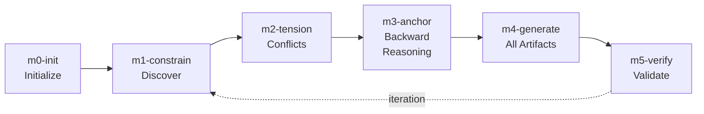

# Quickstart

Get from zero to a verified feature in 15 minutes.

> **Prerequisites:** [Install Manifold](#install) first. Requires Claude Code or AMP.

## Install

```bash
curl -fsSL https://raw.githubusercontent.com/dhanesh/manifold/main/install/install.sh | bash
```

Verify it worked:

```bash
manifold --version
```

This installs: slash commands for Claude Code/AMP, the `manifold` CLI binary, parallel execution library, and context preservation hooks. See [what gets installed](../README.md#install) for details.

## Phase Workflow



## Your First Feature (5 commands)

### 1. Initialize

```bash
/manifold:m0-init notification-preferences --outcome="Users can configure notification preferences with 99% save success rate"
```

This creates two files in `.manifold/`:
- `notification-preferences.json` — Structure (IDs, types, phases)
- `notification-preferences.md` — Content (statements, rationale)

### 2. Discover Constraints

```bash
/manifold:m1-constrain notification-preferences
```

The AI interviews you about 5 categories: **Business**, **Technical**, **UX**, **Security**, **Operational**. Each constraint gets a type:

| Type | Meaning | Example |
|------|---------|---------|
| **invariant** | Must NEVER be violated | "No data loss on failed save" |
| **boundary** | Hard limit | "Save completes in <200ms" |
| **goal** | Optimize toward | "Load preferences in <500ms" |

### 3. Surface Tensions

```bash
/manifold:m2-tension notification-preferences
```

Finds conflicts between constraints. For example: "Save <200ms" conflicts with "audit log every change" (logging adds latency). The AI suggests resolutions and you choose.

### 4. Generate Everything

```bash
/manifold:m4-generate notification-preferences --option=C
```

Creates ALL artifacts simultaneously from your constraints:
- Code with traceability comments (`// Satisfies: B1, T2`)
- Tests that verify constraints (not implementation details)
- Documentation explaining decisions
- Runbooks and alerts for operational constraints

### 5. Verify

```bash
/manifold:m5-verify notification-preferences
```

Checks every constraint is satisfied with evidence. Reports coverage and gaps.

## Check Status Anytime

```bash
manifold status notification-preferences
```

```
Feature: notification-preferences
Phase: VERIFIED (6/6)
Constraints: Business: 3, Technical: 4, UX: 4, Security: 2, Operational: 2
Convergence: CONVERGED
```

## What's Next?

| Goal | Resource |
|------|----------|
| See a complete walkthrough with real outputs | [Walkthrough](walkthrough/README.md) |
| Quick fix that doesn't need full workflow | [Light Mode](../README.md#light-mode) (`/manifold:m-quick`) |
| Use pre-built constraint patterns | [Templates](../install/templates/README.md) |
| Full CLI command reference | [CLI Reference](cli-reference.md) |
| Understand the terminology | [Glossary](GLOSSARY.md) |
| Product Manager workflows | [PM Guide](pm/guide.md) |
| Non-programming use cases | [Non-Programming Guide](non-programming/guide.md) |
| Something went wrong | [Troubleshooting](troubleshooting.md) |
