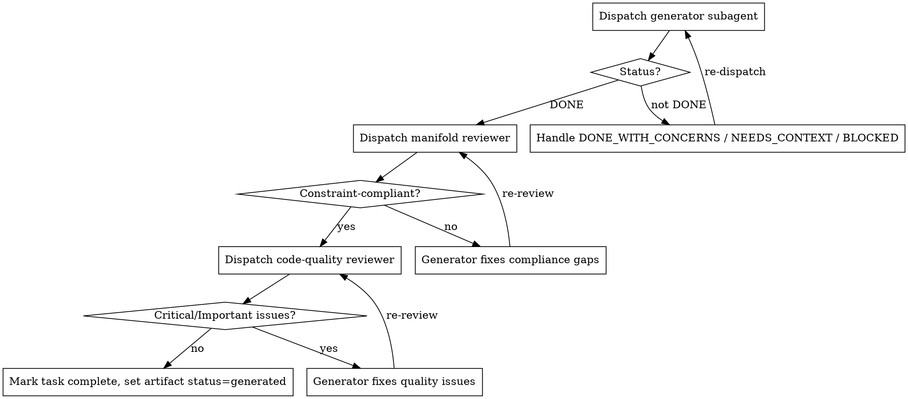

# Subagent-Driven Generation + In-Loop Review — Design

> **Status:** Approved design (brainstorming complete). Next step: implementation plan.
> **Date:** 2026-05-17
> **Branch:** `give_manifold_superpowers`

## 1. Motivation

Manifold and the `superpowers` plugin both front-load thinking before
implementation, but they diverge on *execution* and *review*. A comparison of
the two surfaced patterns worth importing into Manifold:

| superpowers capability | Manifold today |
|---|---|
| Coordinator dispatches a fresh subagent per task with curated context | `m4-generate` produces all artifacts inline in the main session (context pollution) |
| Two-stage per-task review: spec compliance, then code quality | `m5-verify` is a constraint **coverage matrix** only — it never reviews code *quality* |
| Implementer status protocol (`DONE` / `DONE_WITH_CONCERNS` / `NEEDS_CONTEXT` / `BLOCKED`) | Subagents return free text |
| `verification-before-completion` "Iron Law" — no completion claim without fresh evidence | Evidence *types* exist; the behavioral discipline does not |
| Never start implementation on main/master | No such gate |
| Red-flag / rationalization tables, decision digraphs | Mostly prose and tables |

**Key distinction this design rests on:** constraint *verification* (does every
constraint appear in Code/Test/Docs/Ops?) and code *review* (is the code
correct and well-built?) are different questions. `m5-verify` answers the first
and will keep doing so unchanged. This design adds the second.

## 2. Goals

1. Turn `m4-generate` into a **coordinator** that dispatches a fresh subagent
   per task instead of generating everything in the main session.
2. Add **in-loop review** — every task is reviewed for constraint compliance
   and code quality before the next task starts, plus one final pass.
3. Import the **verification-before-completion discipline** and prompt-craft
   patterns (red-flag tables, decision digraphs, status protocol) across all
   workflow commands.
4. Stay **self-contained** — no runtime dependency on the `superpowers`
   plugin. Manifold reimplements the patterns in constraint-native wording.

## 3. Non-Goals (explicitly out of scope for this round)

- An approach-exploration step between `m3-anchor` and `m4-generate` (the
  largest gap found when comparing m1–m3 to superpowers `brainstorming` —
  `--option=A|B|C` currently materializes at generation time, undiscussed).
  Tracked as a separate future sub-project.
- A standing `m5-review` command — review stays inside `m4-generate`.
- A `finishing-a-development-branch` equivalent (merge/PR/cleanup close-out).
- A worktree per implementer — implementers run sequentially on one branch.
- An explicit, reviewable plan document — tasks are derived on the fly.

## 4. Design

### 4.1 `m4-generate` as coordinator

`m4-generate` stops generating artifacts directly. It becomes a thin
coordinator that keeps the main session as a coordination context only.

**Setup gate.** Before any work:
- Manifold is at phase `ANCHORED` and has required truths.
- Work is **not on `main`/`master`** — if it is, offer to create a feature
  branch and stop until the user agrees. (New rule, imported from superpowers.)

**Derive tasks on the fly.** From the required truths (m3-anchor output) plus
the artifact map, group work into cohesive tasks — typically one task per
artifact group, e.g. *"implement `IdempotencyService` + its tests — satisfies
B1, RT-2"*. The task list is **displayed** to the user as a checklist and
tracked in `TodoWrite`. It is not written to a separate plan file.

**Per-task loop — strictly sequential, never parallel implementers:**

Per task, in order:

1. **Dispatch a fresh generator subagent.** The coordinator hands it *curated*
   context only — never session history:
   - The exact constraint / required-truth text pulled from `.manifold/<feature>.md`.
   - Target artifact paths (per the Artifact Placement table in `CLAUDE.md`).
   - The `// Satisfies: B1` traceability convention.
   - The test-derivation rule: tests verify **constraints**, not implementation
     details.
   - Instruction to follow TDD.
2. The generator returns a **status**: `DONE` / `DONE_WITH_CONCERNS` /
   `NEEDS_CONTEXT` / `BLOCKED`. The coordinator handles each per the protocol
   in §4.4.
3. **Manifold reviewer** subagent: does the artifact satisfy *exactly* its
   assigned constraints — nothing missing, no scope creep? Issues → generator
   fixes → re-review until compliant.
4. **Code-quality reviewer** subagent: bugs, edge cases, design, idiomatic
   Bun/TypeScript. Severities Critical / Important / Minor. Critical and
   Important must be fixed → re-review. Minor noted.
5. Mark the task complete in `TodoWrite`; set the artifact status to
   `generated` in `.manifold/<feature>.json`.

**Final pass.** After all tasks: one **final reviewer** subagent reviews the
whole implementation across the full `BASE_SHA..HEAD` diff. Then set phase to
`GENERATED`, print a summary, and **STOP** — no auto-advance to `m5-verify`
(Manifold's explicit phase-transition rule).

**Model tiering** (imported from superpowers): the coordinator picks a model
per subagent — a cheap/fast model for mechanical 1–2 file tasks with complete
constraint specs, a standard model for multi-artifact integration tasks, and a
capable model for the reviewer subagents.

**Philosophy preserved.** Manifold's "generate ALL artifacts simultaneously"
principle is about *deriving* code, tests, docs, and ops from the *same*
constraints — each task still does that. Only the *dispatch* becomes
sequential, which is what makes per-task review possible.

### 4.2 Subagent roles and naming

Naming follows the Manifold theme.

| Role | Name | Responsibility |
|---|---|---|
| Implementer | **generator** subagent | Generates artifacts for one task (phase `GENERATED`) |
| Spec-compliance reviewer | **manifold reviewer** | Checks the artifact against the constraint manifold — exact compliance, no scope creep |
| Quality reviewer | **code-quality reviewer** | Bugs, edge cases, design, idiom (kept descriptive — no thematic word for craft) |
| Whole-implementation reviewer | **final reviewer** | Reviews the full diff after all tasks |

### 4.3 Prompt templates

Self-contained — Manifold ships its own templates rather than calling into
superpowers. New directory `install/commands/references/subagent-prompts/`
(the `references/` directory already exists) with four files:

- `generator.md`
- `manifold-reviewer.md`
- `code-quality-reviewer.md`
- `final-reviewer.md`

`m4-generate.md` references these by path. The coordinator fills placeholders
(constraint text, artifact paths, `BASE_SHA`/`HEAD_SHA`). These files sync to
`plugin/` via the existing `bun scripts/sync-plugin.ts`, and the Gemini/Codex
translations regenerate via `bun run build:commands`.

### 4.4 Generator status protocol

| Status | Coordinator response |
|---|---|
| `DONE` | Proceed to manifold review. |
| `DONE_WITH_CONCERNS` | Read the concerns. Correctness/scope concerns → address before review. Observations → note and proceed. |
| `NEEDS_CONTEXT` | Provide the missing context, re-dispatch. |
| `BLOCKED` | Assess: context problem → add context, re-dispatch; needs more reasoning → re-dispatch with a more capable model; task too large → split; plan is wrong → escalate to the user. Never force the same model to retry unchanged. |

### 4.5 Workflow discipline polish (all commands)

- **New shared reference:** `install/commands/references/execution-discipline.md`,
  the single source of truth for:
  - The verification-before-completion **Iron Law** — no completion claim
    without fresh verification evidence run *in this message*.
  - Red-flag / rationalization tables.
  - The generator status-protocol definitions.
  - The never-start-on-`main` rule.
- **Every workflow command** (`m0-init`, `m1-constrain`, `m2-tension`,
  `m3-anchor`, `m4-generate`, `m5-verify`, `m6-integrate`, `m-quick`,
  `m-solve`) gains a one-line link to that reference and a command-specific
  **Red Flags** section naming its own failure modes.
- Branching decision logic is rendered as Graphviz `dot` digraphs where it
  clarifies a choice.
- **`m5-verify` hardening:** it must not mark a constraint `SATISFIED` on
  `file_exists` evidence alone — require at least `content_match`, and surface
  the Iron Law in its existing Scope Guard. The coverage-matrix behavior is
  otherwise unchanged.

## 5. Schema impact

**None.** `m4-generate` reuses existing artifact statuses (`generated`,
`pending`, `failed`). Review outcomes may optionally be recorded in the
existing `iterations[]` entry as free-form result text — no new fields. No
change to `SCHEMA_REFERENCE.md`.

## 6. Build / distribution impact

- All edits land in `install/` (canonical source) — never in `plugin/`.
- `bun scripts/sync-plugin.ts` copies the new `references/subagent-prompts/`
  files and edited commands to `plugin/`.
- `bun run build:commands` regenerates Gemini (`.toml`) and Codex (`SKILL.md`)
  translations for every edited command.
- The CI diff-guard workflow must pass (it rebuilds artifacts and verifies
  plugin sync).

## 7. Verification approach

Manifold commands are Markdown skill files, so this is prompt engineering —
verification is behavioral, not unit tests:

- Run the reworked `m4-generate` against an existing `examples/` manifold and
  confirm the coordinator dispatches generator + reviewer subagents and honors
  the status protocol.
- `manifold validate <feature>` passes for the example.
- Plugin-sync diff-guard passes (`bun run sync:plugin` produces no diff).
- `bun run build:commands` regenerates cleanly with no errors.
- Spot-check that every edited command links the shared discipline reference
  and that `m5-verify` rejects `file_exists`-only `SATISFIED`.

## 8. Risks

- **Prompt-only change:** behavior depends on the model following the
  coordinator instructions. Mitigation — explicit digraphs and red-flag tables,
  and the never-start-on-main and status-protocol gates are mechanical checks.
- **Cost:** per-task generator + two reviewers + a final pass is more subagent
  invocations than today's inline generation. Mitigation — model tiering;
  cheaper models for mechanical tasks.
- **Polish touches all commands:** larger review surface for this round.
  Accepted deliberately for an end-to-end consistent feel.
