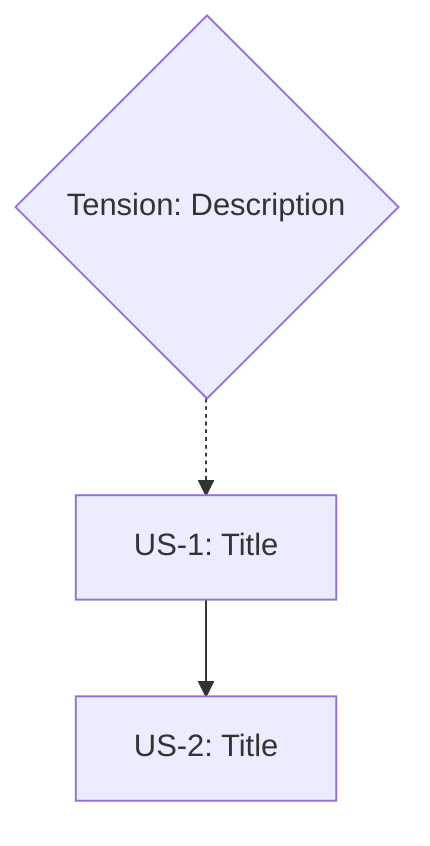

# /manifold:m4-stories

# User Story Generation (`--stories` flag)

> **Module**: Loaded by `/manifold:m4-generate` when `--stories` flag is specified.
> Do not invoke directly.

When `--stories` is specified, generate user stories with acceptance criteria from the manifold.

## Stories Output Location

```
docs/<feature>/STORIES.md
```

## Stories Structure

```markdown
# User Stories: [Feature Name]

_See also: [PRD](PRD.md) for business context and full requirements_

## Epic: [Outcome statement]

### US-1: [Story title derived from U1 statement]
**As a** [user type - derived from PRD Section 4: Target Users & Personas]
**I want** [capability - action verb from constraint statement]
**So that** [value - from constraint rationale]

**Priority:** P0/P1/P2
**Estimate:** [story points placeholder - to be estimated by team]

**Acceptance Criteria:**
- [ ] [Derived from constraint statement]
- [ ] [Derived from related boundary constraint]
- [ ] [Derived from required truth if mapped]

**Traces to:** [constraint IDs]
**PRD Sections:** [cross-reference to relevant PRD section numbers]

---

### US-2: [Story title derived from U2]
...

---

## Story Map

| Priority | Story | Constraints | Dependencies | Estimate | Status |
|----------|-------|-------------|--------------|----------|--------|
| P0 | US-1 | U1, B2 | - | - | Ready |
| P1 | US-2 | U2, T3 | US-1 | - | Blocked |

## Dependencies Graph



---
_Generated from `.manifold/<feature>.json` + `.manifold/<feature>.md`_
_Cross-references: [PRD](PRD.md)_
```

## Constraint-to-Story Transformation Rules

| Source | Story Field | Transformation |
|--------|-------------|----------------|
| `constraints.user_experience` | One story per UX constraint | Primary source |
| Constraint statement | "I want" clause | Extract action verb, user-facing language |
| Constraint rationale | "So that" clause | Focus on value/outcome |
| PRD Section 4 (Personas) | "As a" clause | Use persona from PRD; fallback to constraint context or default "user" |
| Related constraints | Acceptance criteria | One criterion per related constraint |
| `anchors.required_truths` | Acceptance criteria | If maps_to_constraints includes this story's source |
| Boundary constraints | Acceptance criteria | Measurable thresholds |
| `tensions` | Dependencies | Tensions between story constraints |
| PRD Section numbers | PRD Sections field | Cross-reference to relevant PRD sections |

## Story Priority Rules

| Constraint Type | Default Priority | MoSCoW (PRD Section 6) |
|-----------------|------------------|------------------------|
| Invariant-related | P0 (must have) | Must Have |
| Boundary-related | P1 (should have) | Should Have |
| Goal-related | P2 (nice to have) | Could Have |

## Story Dependencies from Tensions

When tensions exist between constraints that map to stories, they become story dependencies:

```json
{
  "tensions": [
    {
      "id": "TN1",
      "type": "trade_off",
      "between": ["U1", "U2"],
      "status": "resolved",
      "decision": "A"
    }
  ]
}
```

In `STORIES.md`, tension-driven dependencies become:

| Priority | Story | Dependencies | Estimate |
|----------|-------|--------------|----------|
| P0 | US-1 (from U1) | - | - |
| P1 | US-2 (from U2) | US-1 | - |

## Stories Generation Example

Input manifold (JSON+MD):

**`.manifold/checkout-redesign.json`**:
```json
{
  "constraints": {
    "user_experience": [
      { "id": "U1", "type": "boundary" },
      { "id": "U2", "type": "goal" }
    ],
    "business": [
      { "id": "B1", "type": "invariant" }
    ]
  },
  "anchors": {
    "required_truths": [
      { "id": "RT-1", "status": "NOT_SATISFIED", "maps_to": ["U1", "B1"] }
    ]
  }
}
```

**`.manifold/checkout-redesign.md`**:
```markdown
#### U1: Quick Checkout
User can complete checkout in 3 steps or fewer.
> **Rationale:** Simplicity drives conversion.

#### U2: Self-Service Success
First-time users succeed without help.
> **Rationale:** Self-service reduces support burden.

#### B1: No Conversion Regression
No conversion regression.

### RT-1: Error-Free Purchase
User completes purchase without errors.
```

Generated stories:
```markdown
### US-1: Quick Checkout Flow
**As a** mobile shopper _(from PRD Persona 1)_
**I want** to complete checkout in 3 steps or fewer
**So that** I can purchase quickly (simplicity drives conversion)

**Priority:** P1 (boundary)
**Estimate:** _To be estimated by team_

**Acceptance Criteria:**
- [ ] Checkout completes in <=3 steps (U1)
- [ ] No conversion regression from baseline (B1)
- [ ] User completes purchase without errors (RT-1)

**Traces to:** U1, B1, RT-1
**PRD Sections:** 4 (Target Users), 6 (Requirements), 7 (User Flows)
```

## Combined Flag Support

When both `--prd` and `--stories` are specified:

```
/manifold:m4-generate payment-checkout --option=C --prd --stories
```

Generates:
- `docs/payment-checkout/PRD.md`
- `docs/payment-checkout/STORIES.md`

Both files cross-reference each other:
- PRD Section 6 (Requirements) links to stories for detailed user requirements
- Stories link back to PRD sections for business context, personas, and user flows

## Stories Artifact Tracking

After stories generation, update `.manifold/<feature>.json`:

```json
{
  "generation": {
    "artifacts": [
      {
        "path": "docs/<feature>/PRD.md",
        "type": "prd",
        "satisfies": ["B1", "B2", "T1", "U1", "S1", "O1"],
        "status": "generated"
      },
      {
        "path": "docs/<feature>/STORIES.md",
        "type": "stories",
        "satisfies": ["U1", "U2", "U3", "U4"],
        "status": "generated"
      }
    ]
  }
}
```
