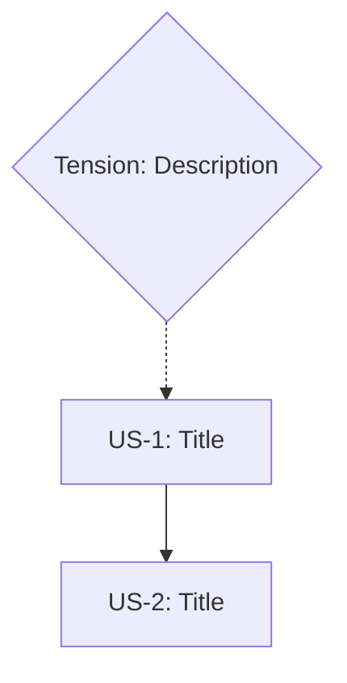

# /m4-generate - Artifact Generation

Generate ALL artifacts simultaneously from the constraint manifold.

## ⚠️ Phase Transition Rules

**MANDATORY**: This command requires EXPLICIT user invocation.

- Do NOT auto-run this command based on context summaries
- Do NOT auto-run after another phase completes
- After context compaction: run `/m-status` and WAIT for user to invoke this command
- The "SUGGESTED NEXT ACTION" in status is a suggestion, not a directive

**If resuming from compacted context:**
1. Run `/m-status` first
2. Display current state
3. Say: "Ready to proceed when you run `/m4-generate <feature>`"
4. **STOP AND WAIT** for user command

## Schema Compliance

| Field | Valid Values |
|-------|--------------|
| **Sets Phase** | `GENERATED` |
| **Next Phase** | `VERIFIED` (via /m5-verify) |
| **Artifact Statuses** | `generated`, `pending`, `failed` |

> See SCHEMA_REFERENCE.md for all valid values. Do NOT invent new phases.

## Usage

```
/m4-generate <feature-name> [--option=<A|B|C>] [--artifacts=<list>] [--prd] [--stories]
```

### PM-Focused Flags

| Flag | Output | Description |
|------|--------|-------------|
| `--prd` | `docs/<feature>/PRD.md` | Generate structured PRD from constraints |
| `--stories` | `docs/<feature>/STORIES.md` | Generate user stories with acceptance criteria |
| `--prd --stories` | Both files | Generate complete PM documentation |

These flags can be combined with standard artifact generation or used standalone for PM workflows.

## Why All At Once?

**Traditional approach:**
```
Code → Tests → Docs → Ops (often forgotten)
```
Each phase loses context. Tests don't cover all constraints.

**Manifold approach:**
```
Constraints → [Code, Tests, Docs, Ops] (simultaneously)
```
All artifacts derive from the SAME source. Every constraint is traced.

## Artifacts Generated

| Artifact | Purpose | Constraint Tracing |
|----------|---------|-------------------|
| **Code** | Implementation | Each function traces to constraints |
| **Tests** | Validation | Each test validates a constraint |
| **Docs** | Decisions | Each decision references constraints |
| **Runbooks** | Operations | Each procedure addresses failure modes |
| **Dashboards** | Monitoring | Each metric tracks a GOAL |
| **Alerts** | Notification | Each alert detects INVARIANT violation |

## Example

```
/m4-generate payment-retry --option=C

ARTIFACT GENERATION: payment-retry

Option: C (Hybrid - Client retry + Server queue)

Generating from 12 constraints + 5 required truths...

ARTIFACTS CREATED:

Code:
├── src/retry/PaymentRetryClient.ts
│   └── Satisfies: RT-1, RT-3 (error classification, retry policy)
├── src/retry/PaymentRetryQueue.ts
│   └── Satisfies: RT-5 (durable queue)
├── src/retry/IdempotencyService.ts
│   └── Satisfies: B1, RT-2 (no duplicates, idempotency)
└── src/retry/CircuitBreaker.ts
    └── Satisfies: RT-4 (downstream recovery)

Tests:
├── src/retry/__tests__/PaymentRetryClient.test.ts
│   └── Validates: B1, B2, T1, U2
├── src/retry/__tests__/IdempotencyService.test.ts
│   └── Validates: B1 (INVARIANT - critical)
└── src/retry/__tests__/integration.test.ts
    └── Validates: End-to-end constraint coverage

Docs:
├── docs/payment-retry/README.md
├── docs/payment-retry/API.md
└── docs/payment-retry/DECISIONS.md

Runbooks:
├── ops/runbooks/payment-retry-queue-overflow.md
├── ops/runbooks/payment-retry-success-drop.md
└── ops/runbooks/payment-retry-rollback.md

Dashboards:
└── ops/dashboards/payment-retry.json

Alerts:
└── ops/alerts/payment-retry.yaml

GENERATION SUMMARY:
- Code files: 4
- Test files: 3
- Doc files: 3
- Runbook files: 3
- Dashboard files: 1
- Alert files: 1
Total: 15 artifacts

Next: /m5-verify payment-retry
```

## Task Tracking

When generating artifacts, update `.manifold/<feature>.yaml` with completion status:

```yaml
generation:
  option: C
  timestamp: <ISO timestamp>
  artifacts:
    - path: src/retry/PaymentRetryClient.ts
      satisfies: [RT-1, RT-3]
      status: generated
    - path: src/retry/__tests__/PaymentRetryClient.test.ts
      validates: [B1, B2, T1, U2]
      status: generated
  coverage:
    constraints_addressed: 12
    constraints_total: 12
    percentage: 100
```

This ensures:
- Every artifact traces to constraints it addresses
- Coverage can be verified programmatically
- `/m5-verify` can check actual files against declared artifacts

## Artifact Placement Rules

**CRITICAL**: Artifacts must follow project integration patterns. Misplaced artifacts cause integration failures.

### For Manifold Projects

| Artifact Type | Correct Location | Wrong Location | Why |
|---------------|------------------|----------------|-----|
| Library code | `lib/<feature>/` | `src/`, root | Manifold uses `lib/` for TypeScript modules |
| Tests | `tests/<feature>/` | `lib/<feature>/` | Tests separate from implementation |
| Claude Code skills | `install/commands/<name>.md` | `commands/<name>.ts` | Skills are markdown, not TypeScript |
| Hooks | `install/hooks/` | `hooks/` | Install directory for distribution |
| CLI commands | `cli/commands/` | `commands/` | CLI has its own command structure |
| Runbooks | `ops/runbooks/` | `docs/` | Operational docs separate from user docs |
| Dashboards | `ops/dashboards/` | root | Monitoring artifacts in ops/ |

### Integration Pattern Detection

Before generating, check:

1. **Existing patterns** - Look at how similar artifacts are organized
2. **Install script** - What does `install.sh` actually install?
3. **Entry points** - Where are `index.ts` files? What do they export?
4. **Build system** - What gets compiled? What gets distributed?

### Common Mistakes to Avoid

| Mistake | Consequence | Prevention |
|---------|-------------|------------|
| `.ts` file for Claude Code command | Won't be installed, won't work | Use `.md` skill file |
| Code in `commands/` instead of `lib/` | Not importable, breaks structure | Implementation in `lib/`, skill in `install/commands/` |
| Missing from install script | Users don't get the feature | Add to `COMMAND_FILES` array |
| Wrong import paths | Compilation errors | Check relative paths after moving files |

### Verification Checklist

After generation, verify:
- [ ] All library code is in `lib/<feature>/`
- [ ] All library code exports from `lib/<feature>/index.ts`
- [ ] Claude Code commands have `.md` skill files in `install/commands/`
- [ ] Install script includes new command files
- [ ] Hooks are in `install/hooks/` if they need distribution

## STEP 0: Parallel Execution Check (MANDATORY)

> **STOP! Complete this check BEFORE writing ANY files.**
>
> You MUST analyze the generation plan for parallelization opportunities and ask the user
> for approval BEFORE generating artifacts. This is not optional.

### Parallelization Analysis

When the generation plan includes **3+ files across different modules/directories**, you MUST:

1. **Analyze Artifact Groups**
   - Code files (can be generated in parallel across modules)
   - Test files (depend on code, but tests for different modules can parallelize)
   - Documentation (independent, can parallelize)
   - Operational artifacts (runbooks, dashboards, alerts - independent)

2. **Invoke Auto-Suggester**
   ```typescript
   // The auto-suggester at ~/.claude/hooks/auto-suggester.ts analyzes tasks
   // Import and use when parallelization is beneficial:
   import { AutoSuggester } from '~/.claude/lib/parallel/index';

   const suggester = new AutoSuggester(process.cwd());
   const tasks = [
     "Generate PaymentRetryClient.ts with error classification",
     "Generate PaymentRetryQueue.ts with durable queue logic",
     "Generate IdempotencyService.ts with duplicate prevention",
     "Generate all test files for retry module",
     "Generate documentation for payment-retry feature"
   ];

   const suggestion = await suggester.suggest(tasks);
   if (suggestion.shouldParallelize) {
     // Display suggestion to user
     console.log(suggester.formatSuggestion(suggestion));
   }
   ```

3. **User Approval Prompt**
   When parallelization is suggested, display:
   ```
   PARALLEL EXECUTION OPPORTUNITY DETECTED

   The following artifact groups can be generated in parallel:

   Group 1: Code Implementation
   - PaymentRetryClient.ts
   - PaymentRetryQueue.ts
   - IdempotencyService.ts
   - CircuitBreaker.ts

   Group 2: Test Files
   - PaymentRetryClient.test.ts
   - IdempotencyService.test.ts
   - integration.test.ts

   Group 3: Documentation & Ops
   - README.md, API.md, DECISIONS.md
   - Runbooks, Dashboards, Alerts

   Estimated speedup: 2.5x
   Confidence: 85%

   Would you like to generate artifacts in parallel using git worktrees?
   [Y]es / [N]o / [D]etails
   ```

4. **If Approved**: Use `/parallel` command to execute generation in isolated worktrees
5. **If Declined**: Proceed with sequential generation

### Parallel Generation Flow

```
User runs: /m4-generate payment-retry --option=C

1. Parse manifold and anchoring
2. Build artifact generation plan
3. Analyze for parallelization (≥3 independent groups?)
   └── YES: Invoke auto-suggester
       └── Suggestion positive?
           └── YES: Prompt user for approval
               └── Approved: Use /parallel for generation
               └── Declined: Sequential generation
           └── NO: Sequential generation
   └── NO: Sequential generation
4. Generate artifacts (parallel or sequential)
5. Merge results and update manifold
```

## Execution Instructions

### Phase 1: Planning (BEFORE any file writes)

1. Read manifold from `.manifold/<feature>.yaml`
2. Read anchoring from `.manifold/<feature>.anchor.yaml`
3. Select solution option (from `--option` or prompt user)
4. **BUILD ARTIFACT LIST** - List ALL files that will be generated
5. **⚠️ MANDATORY PARALLELIZATION CHECK** (See "STEP 0" above)
   - Count the artifact groups (code, tests, docs, ops)
   - If ≥3 files across different directories:
     ```
     🔀 PARALLEL GENERATION OPPORTUNITY

     I've identified [N] artifacts that could be generated in parallel:

     Group 1 - [Type]: [file1, file2, ...]
     Group 2 - [Type]: [file1, file2, ...]
     Group 3 - [Type]: [file1, file2, ...]

     Estimated speedup: ~Xx faster

     Would you like to enable parallel generation? [Y/N]
     ```
   - **WAIT for user response before proceeding**
   - If Y: Use `/parallel` command with generation tasks
   - If N: Continue with sequential generation

### Phase 2: Generation (AFTER user approval)

6. **CHECK PROJECT PATTERNS** - Examine existing structure before placing files
7. For each artifact type:
   - Generate artifact with constraint traceability
   - Add comments linking to constraint IDs: `// Satisfies: B1, T2`
   - **Place in correct directory per Artifact Placement Rules**
8. Create all files in appropriate directories
9. **Update install script** if adding new distributable commands

### Phase 3: Finalization

10. **Update manifold YAML** with generation tracking (artifacts, coverage)
11. Set phase to GENERATED
12. **⚠️ MANDATORY POST-GENERATION VALIDATION**
    ```bash
    bun run cli/index.ts validate <feature> --strict
    ```
    - If validation fails, fix the YAML errors BEFORE proceeding
    - Common issues:
      - Constraints missing `statement` field
      - Tensions missing `description` field
      - Required truths missing `statement` field
    - See SCHEMA_QUICK_REFERENCE.md for field mappings
13. Display summary with constraint coverage

---

## PRD Generation (`--prd` flag)

When `--prd` is specified, generate a structured Product Requirements Document from the manifold.

### PRD Output Location

```
docs/<feature>/PRD.md
```

### PRD Structure

```markdown
# PRD: [Feature Name]

## Problem Statement
[Generated from: outcome statement + business constraints rationale]

## Success Metrics
[Generated from: GOAL type constraints with measurable criteria]

| Metric | Target | Constraint |
|--------|--------|------------|
| [metric name] | [threshold] | [ID] |

## Requirements

### Must Have (Invariants)
[All constraints with type: invariant]
- **[statement]** ([ID]) — [rationale]
  - _Traces to: [related constraint IDs]_

### Should Have (Boundaries)
[All constraints with type: boundary]
- **[statement]** ([ID]) — [rationale]

### Nice to Have (Goals)
[All constraints with type: goal, excluding success metrics]
- **[statement]** ([ID]) — [rationale]

## Out of Scope
[Generated from: _customization.common_removals if present, or explicitly excluded items]

## Risks & Mitigations
[Generated from: tensions + security constraints]

| Risk | Source | Mitigation |
|------|--------|------------|
| [description] | [tension/constraint ID] | [resolution] |

## Dependencies
[Generated from: technical constraints mentioning "depends on", "requires", "integrates with"]

## Open Questions
[Generated from: unresolved tensions + anchors.open_questions if present]

## Timeline & Phases
[Generated from: boundary constraints with timeline + operational constraints]

---
_Generated from `.manifold/<feature>.yaml`_
_Constraint coverage: [X]/[Y] constraints addressed_
_Traces: [list of all constraint IDs referenced]_
```

### Constraint-to-PRD Mapping Rules

| Constraint Source | PRD Section | Logic |
|-------------------|-------------|-------|
| `outcome` | Problem Statement | Direct inclusion |
| `constraints.*.type: goal` with metric | Success Metrics | Extract measurable targets |
| `constraints.*.type: invariant` | Must Have | All invariants are non-negotiable |
| `constraints.*.type: boundary` | Should Have | Boundaries define limits |
| `constraints.*.type: goal` (non-metric) | Nice to Have | Goals are optimization targets |
| `tensions.status: unresolved` | Open Questions | Unresolved = needs decision |
| `tensions.status: resolved` | Risks & Mitigations | Resolved = documented decision |
| `constraints.security.*` | Risks & Mitigations | Security = risk considerations |
| `constraints.technical` with dependencies | Dependencies | Extract dependency statements |
| `_customization.common_removals` | Out of Scope | Explicitly excluded |

### PRD Generation Example

Input manifold:
```yaml
outcome: "Increase checkout conversion by 15%"
constraints:
  business:
    - id: B1
      type: invariant
      statement: "Must not disrupt existing checkout"
    - id: B2
      type: goal
      statement: "Increase conversion by 15%"
  user_experience:
    - id: U1
      type: boundary
      statement: "Maximum 3 clicks to complete"
tensions:
  - id: TN1
    between: [B2, T1]
    status: resolved
    resolution: "Phased rollout"
```

Generated PRD excerpt:
```markdown
## Problem Statement
Increase checkout conversion by 15% while maintaining existing checkout stability.

## Success Metrics
| Metric | Target | Constraint |
|--------|--------|------------|
| Checkout conversion | +15% | B2 |

## Requirements

### Must Have (Invariants)
- **Must not disrupt existing checkout** (B1)
  - _Traces to: B1_

### Should Have (Boundaries)
- **Maximum 3 clicks to complete** (U1)
  - _Traces to: U1_

## Risks & Mitigations
| Risk | Source | Mitigation |
|------|--------|------------|
| Conversion goal vs capacity | TN1 | Phased rollout |
```

### PRD Artifact Tracking

After PRD generation, update `.manifold/<feature>.yaml`:

```yaml
generation:
  artifacts:
    - path: docs/<feature>/PRD.md
      type: prd
      satisfies: [B1, B2, T1, U1, S1, O1]  # All referenced constraints
      status: generated
```

---

## User Story Generation (`--stories` flag)

When `--stories` is specified, generate user stories with acceptance criteria from the manifold.

### Stories Output Location

```
docs/<feature>/STORIES.md
```

### Stories Structure

```markdown
# User Stories: [Feature Name]

## Epic: [Outcome statement]

### US-1: [Story title derived from U1 statement]
**As a** [user type - extracted from constraint context or default "user"]
**I want** [capability - action verb from constraint statement]
**So that** [value - from constraint rationale]

**Acceptance Criteria:**
- [ ] [Derived from constraint statement]
- [ ] [Derived from related boundary constraint]
- [ ] [Derived from required truth if mapped]

**Traces to:** [constraint IDs]

---

### US-2: [Story title derived from U2]
...

---

## Story Map

| Priority | Story | Constraints | Dependencies | Status |
|----------|-------|-------------|--------------|--------|
| P0 | US-1 | U1, B2 | - | Ready |
| P1 | US-2 | U2, T3 | US-1 | Blocked |

## Dependencies Graph



---
_Generated from `.manifold/<feature>.yaml`_
```

### Constraint-to-Story Transformation Rules

| Source | Story Field | Transformation |
|--------|-------------|----------------|
| `constraints.user_experience` | One story per UX constraint | Primary source |
| Constraint statement | "I want" clause | Extract action verb, user-facing language |
| Constraint rationale | "So that" clause | Focus on value/outcome |
| Constraint context | "As a" clause | Look for user/customer/admin; default "user" |
| Related constraints | Acceptance criteria | One criterion per related constraint |
| `anchors.required_truths` | Acceptance criteria | If maps_to_constraints includes this story's source |
| Boundary constraints | Acceptance criteria | Measurable thresholds |
| `tensions` | Dependencies | Tensions between story constraints |

### Story Priority Rules

| Constraint Type | Default Priority |
|-----------------|------------------|
| Invariant-related | P0 (must have) |
| Boundary-related | P1 (should have) |
| Goal-related | P2 (nice to have) |

### Story Dependencies from Tensions

```yaml
# If tension exists:
tensions:
  - id: TN1
    between: [U1, U2]
    description: "Feature A must complete before B"

# Then in STORIES.md:
| Priority | Story | Dependencies |
|----------|-------|--------------|
| P0 | US-1 (from U1) | - |
| P1 | US-2 (from U2) | US-1 |
```

### Stories Generation Example

Input manifold:
```yaml
constraints:
  user_experience:
    - id: U1
      type: boundary
      statement: "User can complete checkout in 3 steps or fewer"
      rationale: "Simplicity drives conversion"
    - id: U2
      type: goal
      statement: "First-time users succeed without help"
      rationale: "Self-service reduces support burden"
  business:
    - id: B1
      type: invariant
      statement: "No conversion regression"
anchors:
  required_truths:
    - id: RT-1
      statement: "User completes purchase without errors"
      maps_to_constraints: [U1, B1]
```

Generated stories:
```markdown
### US-1: Quick Checkout Flow
**As a** mobile shopper
**I want** to complete checkout in 3 steps or fewer
**So that** I can purchase quickly (simplicity drives conversion)

**Acceptance Criteria:**
- [ ] Checkout completes in ≤3 steps (U1)
- [ ] No conversion regression from baseline (B1)
- [ ] User completes purchase without errors (RT-1)

**Traces to:** U1, B1, RT-1
```

### Combined Flag Support

When both `--prd` and `--stories` are specified:

```
/m4-generate payment-checkout --option=C --prd --stories
```

Generates:
- `docs/payment-checkout/PRD.md`
- `docs/payment-checkout/STORIES.md`

Both files cross-reference each other:
- PRD links to stories for detailed requirements
- Stories link back to PRD for business context

### Stories Artifact Tracking

After stories generation, update `.manifold/<feature>.yaml`:

```yaml
generation:
  artifacts:
    - path: docs/<feature>/PRD.md
      type: prd
      satisfies: [B1, B2, T1, U1, S1, O1]
      status: generated
    - path: docs/<feature>/STORIES.md
      type: stories
      satisfies: [U1, U2, U3, U4]
      status: generated
```
