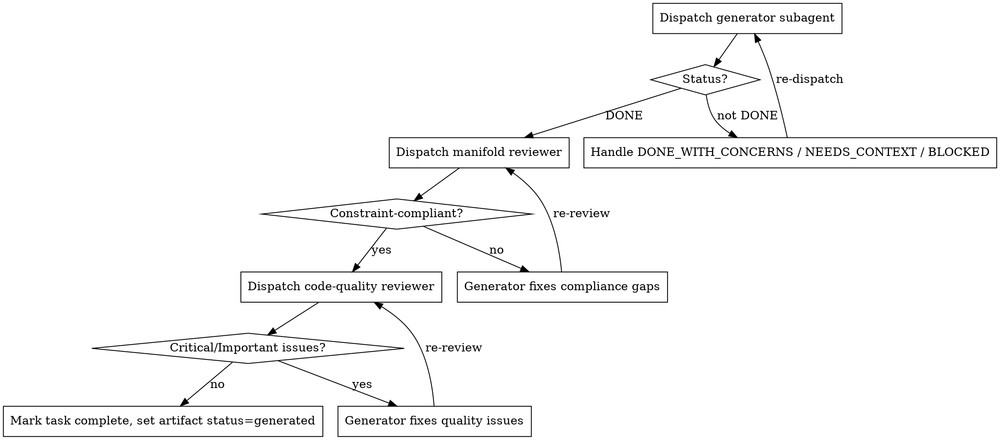

# /manifold:m4-generate - Artifact Generation

Generate ALL artifacts simultaneously from the constraint manifold.

## Schema Compliance

| Field | Valid Values |
|-------|--------------|
| **Sets Phase** | `GENERATED` |
| **Next Phase** | `VERIFIED` (via /manifold:m5-verify) |
| **Artifact Statuses** | `generated`, `pending`, `failed` |

> See SCHEMA_REFERENCE.md for all valid values. Do NOT invent new phases.

## Usage

```
/manifold:m4-generate <feature-name> [--option=<A|B|C>] [--artifacts=<list>] [--prd] [--stories]
```

### PM-Focused Flags

| Flag | Output | Description |
|------|--------|-------------|
| `--prd` | `docs/<feature>/PRD.md` | Generate structured PRD from constraints |
| `--stories` | `docs/<feature>/STORIES.md` | Generate user stories with acceptance criteria |
| `--prd --stories` | Both files | Generate complete PM documentation |

## Why All At Once?

Traditional: Code then Tests then Docs then Ops (each phase loses context, tests miss constraints).
Manifold: Constraints produce [Code, Tests, Docs, Ops] from the SAME source with full traceability.

**Execution model.** `m4-generate` does not write artifacts itself. It is a
**coordinator**: it derives discrete tasks from the manifold, then dispatches a
fresh **generator subagent** per task. Each task still derives its code, tests,
and docs together from the same constraints — only the dispatch is sequential,
which is what makes per-task review possible. See the Coordinator Model section.

## Artifacts Generated

| Artifact | Purpose | Constraint Tracing |
|----------|---------|-------------------|
| **Code** | Implementation | Each function traces to constraints |
| **Tests** | Validation | Each test validates a constraint |
| **Docs** | Decisions | Each decision references constraints |
| **Runbooks** | Operations | Each procedure addresses failure modes |
| **Dashboards** | Monitoring | Each metric tracks a GOAL |
| **Alerts** | Notification | Each alert detects INVARIANT violation |

## Coordinator Model

`m4-generate` runs as a coordinator. It dispatches subagents; it does not write
artifacts directly. The main session stays a thin coordination context. Four
subagent roles, all driven by templates in
[`references/subagent-prompts/`](references/subagent-prompts/):

| Role | Template | Responsibility |
|------|----------|----------------|
| **generator** | `generator.md` | Implements one task's artifacts via TDD |
| **manifold reviewer** | `manifold-reviewer.md` | Checks artifacts against the constraint manifold — compliance + scope; not quality |
| **code-quality reviewer** | `code-quality-reviewer.md` | Bugs, edge cases, design, idiom |
| **final reviewer** | `final-reviewer.md` | Whole-implementation pass after all tasks |

Generators are dispatched **strictly sequentially** — never two at once. The
per-task loop:


```dot
digraph m4_loop {
    rankdir=TB;
    "Dispatch generator subagent" [shape=box];
    "Status?" [shape=diamond];
    "Handle DONE_WITH_CONCERNS / NEEDS_CONTEXT / BLOCKED" [shape=box];
    "Dispatch manifold reviewer" [shape=box];
    "Constraint-compliant?" [shape=diamond];
    "Generator fixes compliance gaps" [shape=box];
    "Dispatch code-quality reviewer" [shape=box];
    "Critical/Important issues?" [shape=diamond];
    "Generator fixes quality issues" [shape=box];
    "Mark task complete, set artifact status=generated" [shape=box];

    "Dispatch generator subagent" -> "Status?";
    "Status?" -> "Handle DONE_WITH_CONCERNS / NEEDS_CONTEXT / BLOCKED" [label="not DONE"];
    "Handle DONE_WITH_CONCERNS / NEEDS_CONTEXT / BLOCKED" -> "Dispatch generator subagent" [label="re-dispatch"];
    "Status?" -> "Dispatch manifold reviewer" [label="DONE"];
    "Dispatch manifold reviewer" -> "Constraint-compliant?";
    "Constraint-compliant?" -> "Generator fixes compliance gaps" [label="no"];
    "Generator fixes compliance gaps" -> "Dispatch manifold reviewer" [label="re-review"];
    "Constraint-compliant?" -> "Dispatch code-quality reviewer" [label="yes"];
    "Dispatch code-quality reviewer" -> "Critical/Important issues?";
    "Critical/Important issues?" -> "Generator fixes quality issues" [label="yes"];
    "Generator fixes quality issues" -> "Dispatch code-quality reviewer" [label="re-review"];
    "Critical/Important issues?" -> "Mark task complete, set artifact status=generated" [label="no"];
}
```

**Model tiering** — pick the cheapest model that fits each dispatch:

| Dispatch | Model |
|----------|-------|
| Generator — mechanical 1–2 file task with a complete constraint spec | fast / cheap |
| Generator — multi-artifact integration task | standard |
| Any reviewer (manifold / code-quality / final) | most capable available |

## Example

```
/manifold:m4-generate payment-retry --option=C

ARTIFACT GENERATION: payment-retry
Option: C (Hybrid - Client retry + Server queue)
Generating from 12 constraints + 5 required truths...

ARTIFACTS CREATED:
Code:
├── src/retry/PaymentRetryClient.ts     — Satisfies: RT-1, RT-3
├── src/retry/PaymentRetryQueue.ts      — Satisfies: RT-5
├── src/retry/IdempotencyService.ts     — Satisfies: B1, RT-2
└── src/retry/CircuitBreaker.ts         — Satisfies: RT-4

Tests:
├── src/retry/__tests__/PaymentRetryClient.test.ts  — Validates: B1, B2, T1, U2
├── src/retry/__tests__/IdempotencyService.test.ts  — Validates: B1 (INVARIANT)
└── src/retry/__tests__/integration.test.ts         — Validates: end-to-end

Docs: docs/payment-retry/{README,API,DECISIONS}.md
Runbooks: ops/runbooks/payment-retry-{queue-overflow,success-drop,rollback}.md
Dashboards: ops/dashboards/payment-retry.json
Alerts: ops/alerts/payment-retry.yaml

Total: 15 artifacts | Next: /manifold:m5-verify payment-retry
```

## Task Tracking

When generating artifacts, update `.manifold/<feature>.json` with completion status:

```json
{
  "generation": {
    "option": "C",
    "timestamp": "<ISO timestamp>",
    "artifacts": [
      {
        "path": "src/retry/PaymentRetryClient.ts",
        "type": "code",
        "satisfies": ["RT-1", "RT-3"],
        "status": "generated",
        "artifact_class": "substantive"
      },
      {
        "path": "src/retry/index.ts",
        "type": "code",
        "satisfies": ["RT-1"],
        "status": "generated",
        "artifact_class": "structural"
      }
    ],
    "coverage": {
      "constraints_addressed": 12,
      "constraints_total": 12,
      "percentage": 100
    }
  },
  "anchors": {
    "required_truths": [
      {
        "id": "RT-1",
        "status": "NOT_SATISFIED",
        "maps_to": ["B1", "T1"],
        "evidence": [
          {"id": "E1", "type": "file_exists", "path": "src/retry/PaymentRetryClient.ts", "status": "PENDING"},
          {"id": "E2", "type": "content_match", "path": "src/retry/PaymentRetryClient.ts", "pattern": "classifyError", "status": "PENDING"},
          {"id": "E3", "type": "test_passes", "path": "src/retry/__tests__/PaymentRetryClient.test.ts", "test_name": "classifies transient errors correctly", "status": "PENDING"}
        ]
      }
    ]
  }
}
```

## Artifact Placement Rules

| Artifact Type | Correct Location | Why |
|---------------|------------------|-----|
| Library code | `lib/<feature>/` | Manifold uses `lib/` for TypeScript modules |
| Tests | `tests/<feature>/` | Tests separate from implementation |
| Claude Code skills | `install/commands/<name>.md` | Skills are markdown, not TypeScript |
| Hooks | `install/hooks/` | Install directory for distribution |
| CLI commands | `cli/commands/` | CLI has its own command structure |
| Runbooks | `ops/runbooks/` | Operational docs separate from user docs |
| Dashboards | `ops/dashboards/` | Monitoring artifacts in ops/ |

Before generating, check existing patterns, install script, entry points, and build system.

## Evidence and Traceability (v3)

### Evidence Type Selection

| When you need to verify... | Use evidence type |
|---------------------------|-------------------|
| A file was created | `file_exists` |
| Code contains expected patterns | `content_match` |
| A specific test exists and can pass | `test_passes` |
| Requires human review | `manual_review` |

**Rules:**
- Every required truth MUST have at least one evidence item
- Invariant constraints (via `maps_to`) MUST have `test_passes` evidence
- All evidence starts with `"status": "PENDING"` -- verification updates status later
- Evidence paths must be relative to project root

### Constraint Evidence (verified_by)

For constraints that can be directly verified, add `verified_by` to the constraint in JSON. Optional but recommended for `invariant` types. Same evidence format as required truths. Provides a secondary verification path independent of the RT `maps_to` chain.

### Artifact Classification

| Class | Meaning | Counts toward satisfaction? | Examples |
|-------|---------|---------------------------|----------|
| `substantive` | Contains logic, tests, or assertions | Yes | Implementation files, test files, runbooks |
| `structural` | Boilerplate, re-exports, config | No | `index.ts` barrel exports, `__init__.py` |

Every artifact MUST have `artifact_class`. Only `substantive` artifacts count toward constraint satisfaction. When in doubt, classify as `substantive`.

## Reversibility Tagging

Every action step in the generated plan MUST carry a reversibility tag.

| Tag | Meaning | Implication |
|-----|---------|-------------|
| `TWO_WAY` | Reversible with minimal cost | Proceed normally |
| `REVERSIBLE_WITH_COST` | Can reverse with meaningful cost | Flag and note the cost |
| `ONE_WAY` | Closes options permanently | Require explicit acknowledgment |

Group all `ONE_WAY` steps into a dedicated section requiring explicit acknowledgment. Add "What This Decision Closes" to the decision brief.

Schema in `.manifold/<feature>.json`:
```json
{
  "reversibility_log": [
    {"action_step": 1, "description": "Migrate database schema", "reversibility": "ONE_WAY", "one_way_consequence": "Old schema format becomes unreadable"},
    {"action_step": 2, "description": "Deploy new API version", "reversibility": "TWO_WAY"}
  ]
}
```

## Non-Software Domain Branching

When `--domain=non-software` is set (from m0-init), generate non-software artifacts instead of code:

| Non-Software Artifact | Software Equivalent | Output Path |
|----------------------|---------------------|-------------|
| Decision Brief | Implementation code | `docs/<feature>/DECISION_BRIEF.md` |
| Scenario Stress-Tests | Test suite | `docs/<feature>/STRESS_TESTS.md` |
| Narrative Guide | Documentation | `docs/<feature>/NARRATIVE_GUIDE.md` |
| Recovery Playbook | Runbooks | `docs/<feature>/RECOVERY_PLAYBOOK.md` |
| Risk Watch List | Dashboards + Alerts | `docs/<feature>/RISK_WATCH_LIST.md` |

All non-software artifacts maintain full constraint traceability. Reversibility tagging applies to both domains. Invariant constraints appear in ALL artifacts. ONE_WAY decisions get special treatment in Decision Brief and Recovery Playbook. Binding constraint appears front-and-center in Decision Brief.

**Template structures:**
- **Decision Brief**: Decision Statement, Constraint Satisfaction table, Options Considered (with reversibility), What This Decision Closes, Binding Constraint, Open Assumptions table
- **Scenario Stress-Tests**: One scenario per invariant/boundary constraint and per resolved tension. Each: Setup, Expected behavior, Constraint tested, Pass criteria
- **Narrative Guide**: Prose narrative of why the decision was made, immovable vs negotiable constraints, key tensions and resolutions, what was NOT chosen, when to revisit
- **Recovery Playbook**: One procedure per watch-list risk. Each: Trigger, Related constraint, Severity, Reversibility of response, Steps, Escalation path (3 levels)
- **Risk Watch List**: Active risks, Assumption Watch table, Review Schedule, Decision Reversal Criteria checklist

## STEP 0: Binding Constraint Check (MANDATORY)

Before any planning or generation, read `anchors.binding_constraint` from `.manifold/<feature>.json`.

If present:
- Display: `BINDING CONSTRAINT: [RT-ID] -- [reason]`
- Artifacts satisfying the binding constraint's required truth MUST be generated FIRST
- Tag these artifacts in the generation summary
- If the binding constraint's RT has unresolved evidence after generation, WARN before completing m4

If absent: proceed normally (backward compatible).

## STEP 0: Parallel Execution Check

The coordinator dispatches generator subagents sequentially by default (see
Coordinator Model). Worktree-level parallelism via `/manifold:parallel` remains
available as an explicit opt-in when the generation plan includes 3+ files
across different modules/directories:

1. **Analyze artifact groups**: Code (parallel across modules), Tests (parallel across modules, depend on code), Documentation (independent), Operational artifacts (independent)
2. **Run**: `manifold solve <feature> --json` to get execution plan with parallel waves
3. **Prompt user**: Show groups, estimated speedup, and ask for approval
4. **If approved**: Use `/manifold:parallel` for generation in isolated worktrees
5. **If declined**: Proceed with sequential generation

## Execution Instructions

> Read [`references/execution-discipline.md`](references/execution-discipline.md)
> before starting. The Iron Law of verification, the never-start-on-`main`
> rule, and the generator status protocol all apply to this phase.

### Phase 0: Setup Gate

1. Confirm the manifold is at phase `ANCHORED` with required truths present.
2. Confirm the working branch is NOT `main` / `master`. If it is, offer to
   create a feature branch via `AskUserQuestion` and STOP until the user agrees.
3. Run the STEP 0 checks above (binding constraint; parallel-execution opt-in).

### Phase 1: Derive Tasks

4. Read `.manifold/<feature>.json` and `.manifold/<feature>.md`.
5. Select the solution option (from `--option`, or prompt via `AskUserQuestion`).
6. Group the required truths + artifact map into cohesive TASKS — typically one
   task per artifact group (e.g. "implement IdempotencyService + tests —
   satisfies B1, RT-2"). Order tasks by binding-constraint priority.
7. Display the task checklist and track it in TodoWrite.
8. If `--prd` is set, read `install/commands/m4-prd.md`; if `--stories` is set,
   read `install/commands/m4-stories.md`. These run after the task loop.

### Phase 2: Per-Task Coordination Loop

For each task, IN ORDER — never two generators at once:

9. Dispatch a generator subagent using the
   [`references/subagent-prompts/generator.md`](references/subagent-prompts/generator.md)
   template. Fill placeholders with the constraint text from `.manifold/<feature>.md`,
   the target artifact paths (per Artifact Placement Rules), and the task
   description. Pick the model per the Coordinator Model tiering. The subagent
   receives NO session history.
10. Handle the returned `STATUS:` line per the protocol in
    `references/execution-discipline.md`.
11. On `DONE`, dispatch a manifold reviewer using
    [`references/subagent-prompts/manifold-reviewer.md`](references/subagent-prompts/manifold-reviewer.md).
    If `NON_COMPLIANT`, re-dispatch the same generator to fix the listed issues,
    then re-review. Repeat until `COMPLIANT`.
12. Then dispatch a code-quality reviewer using
    [`references/subagent-prompts/code-quality-reviewer.md`](references/subagent-prompts/code-quality-reviewer.md).
    If `CHANGES_REQUESTED`, re-dispatch the generator to fix all Critical and
    Important issues, then re-review. Repeat until `APPROVED`.
13. Mark the task complete in TodoWrite; set the artifact `status` to
    `generated` in `.manifold/<feature>.json`.

### Phase 3: Final Pass

14. After all tasks, dispatch a final reviewer using
    [`references/subagent-prompts/final-reviewer.md`](references/subagent-prompts/final-reviewer.md)
    over the full `BASE_SHA..HEAD` diff. On `CHANGES_REQUESTED`, re-dispatch
    generators to fix the issues, then re-run the final reviewer.

### Phase 4: Finalization

15. **Update manifold** with generation tracking (artifacts, coverage) in
    `.manifold/<feature>.json`.
16. **Populate `evidence` arrays** on all required truths with concrete items.
17. **Immediate evidence validation** — check what CAN be verified now:
    - `file_exists`: check the file exists on disk; if missing, flag GENERATION_FAILED.
    - `content_match`: grep the pattern; if no match, flag CONTENT_MISMATCH.
    - `test_passes` / `manual_review`: leave as PENDING (m5's job).
18. **Set `artifact_class`** on every artifact (`substantive` or `structural`).
19. **Verify invariant evidence**: ensure at least one `test_passes` evidence
    exists via the RT `maps_to` chain or `verified_by`.
20. Set phase to `GENERATED`.
21. Run `manifold validate <feature>` and fix errors.
22. Display the coverage summary; end with the suggested next command
    `/manifold:m5-verify <feature>`. Do NOT auto-advance to m5.

## Red Flags

| Thought | Reality |
|---|---|
| "I'll generate the artifacts inline, it's faster" | The coordinator dispatches generator subagents — inline generation pollutes the coordination context. |
| "The generator said DONE, move on" | Dispatch the manifold reviewer, then the code-quality reviewer. A `DONE` is not a review. |
| "Spec review passed, skip code-quality review" | Both reviews are required, in that order. |
| "Reviewer found Minor issues only — but also one Important — ship it" | Critical and Important issues must be fixed and re-reviewed before the next task. |
| "Generating on `main` is fine this once" | Never. Create a feature branch first. |

## User Interaction (MANDATORY)

Generation has two recurring decision points: (a) parallel-execution approval (STEP 0) — user confirms before isolated worktrees spin up; (b) ONE_WAY action acknowledgement — explicit user accept on irreversible steps. **Every such confirmation MUST go through `AskUserQuestion`** (or the agent-equivalent: numbered options for Gemini, labelled choices for Codex).

- The parallelisation prompt for ≥3-file/multi-module plans is mandatory and must use `AskUserQuestion` — not a prose "OK to proceed?" question.
- ONE_WAY steps in the reversibility log require explicit acknowledgement; that acknowledgement question goes through `AskUserQuestion`.
- If `--option` is omitted and the manifold has multiple solution options, the option-selection prompt uses `AskUserQuestion`.
- Exceptions: rhetorical phrasing inside explanations, or "I will assume X — say so if not" assumption call-outs.
- The final coverage summary at the end does NOT need `AskUserQuestion` — end with the suggested next command (`/manifold:m5-verify <feature>`).

See `install/agents/interaction-rules.md` for the canonical contract; the `prompt-enforcer.ts` hook injects the same rules at runtime as defence-in-depth.

Run `manifold validate <feature>` after updates. Shared directives (output format, interaction rules, validation) injected by phase-commons hook.
